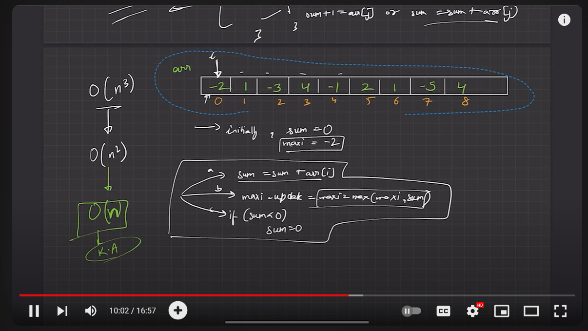
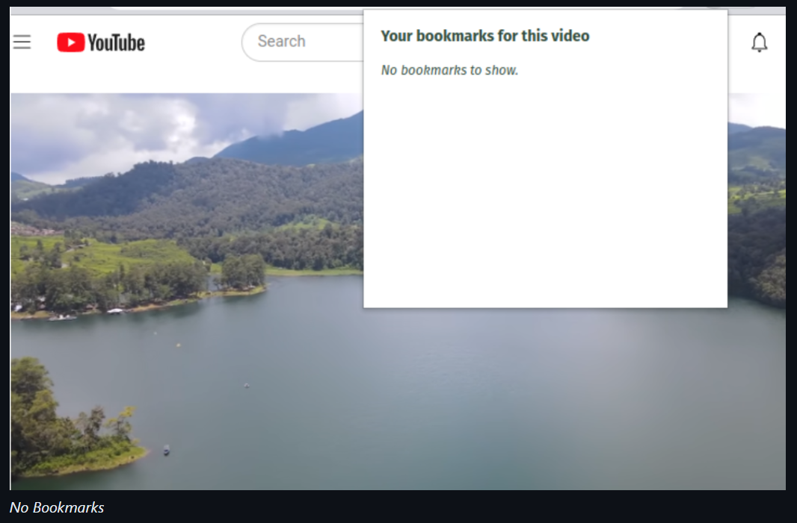
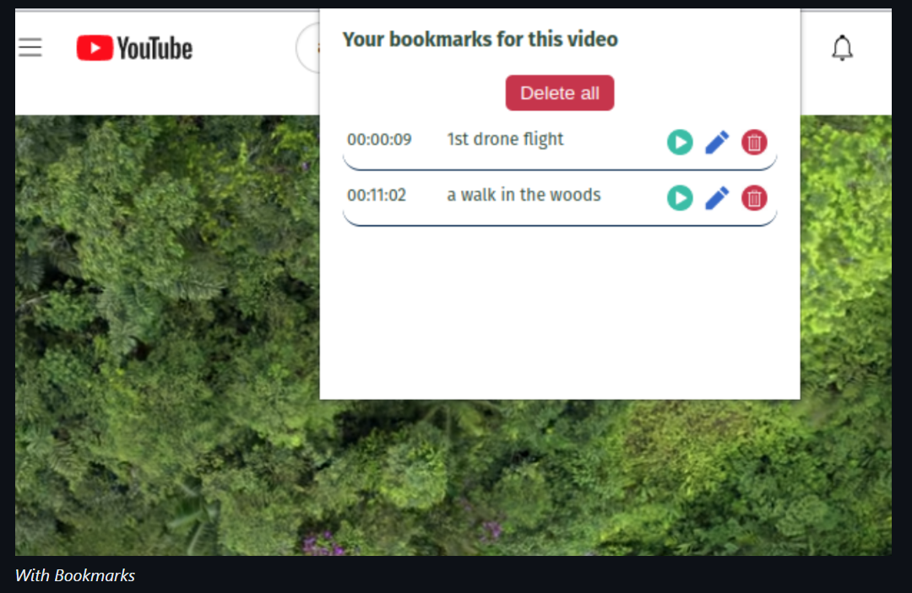
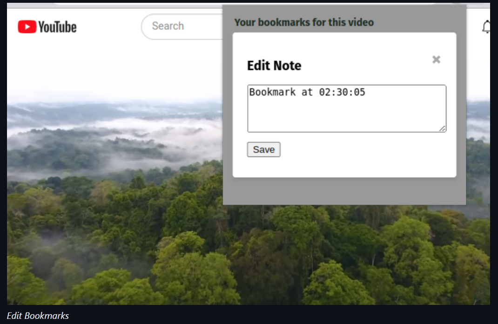

# YouTube Tools Chrome Extension

## Overview
The YouTube Tools Chrome extension enhances your YouTube experience by providing bookmarking functionalities for videos, along with an ad blocker to eliminate ads while watching. With this extension, you can add, delete, and edit video bookmarks, and enjoy uninterrupted viewing without ads.

 Clicking the plus sign indicates adding bookmarks to the video.

## Features
- **Video Bookmarking**:
- Create bookmarks with notes
- View and manage saved bookmarks
- Easy navigation to specific timestamps
- Edit existing bookmarks
- Delete bookmarks.
- **Ad Blocker**: Blocks ads on YouTube videos for uninterrupted viewing.
- **Easy to Use**: Simple and intuitive interface for smooth navigation and control.

## How to Use
You can use this Chrome extension without installing it from the Chrome Web Store by following these simple steps:

1. **Clone the Repository**: 
   Clone this repository to your local machine using Git. Open your terminal or command prompt and run the following command:
   
   https://github.com/HanumappaAK/YouTube-Tools.git

2. **Enable Developer Mode in Chrome**:
Open Google Chrome and go to `chrome://extensions/`.

3. **Load Unpacked**:
Enable Developer Mode by toggling the switch in the upper-right corner.
Click on the "Load unpacked" button, then select the directory where you cloned this repository.

4. **Open Extension**:
Once loaded, the extension should appear in your list of installed extensions. Click on the extension icon in the Chrome toolbar to open it.

5. **Using Bookmarking Feature**:
- To add a bookmark, click on the extension icon while watching a YouTube video. Enter a name for the bookmark and click "Add".
- To delete a bookmark, click on the bookmark in the extension popup and then click on the delete button.
- To edit a bookmark, click on the bookmark in the extension popup, edit the name, and click "Save".

6. **Using Ad Blocker**:
- Ad blocking is automatic. Once the extension is enabled, it will block ads on YouTube videos.

## Understanding the Code:
In this section, the main logic of the extension in the popup.js script is explained.

  - showEditModal: Displays the edit modal for editing the bookmark text.
  - saveEditedNote: Saves the edited bookmark text.
  - showFullNote: Displays the full note when the truncated note is clicked.
  - addNewBookmark: Adds a new bookmark element to the list of bookmarks.
  - viewBookmarks: Displays all saved bookmarks for the current video.
  - onPlay: Jumps to the timestamp of the clicked bookmark.
  - onEdit: Opens the edit modal for the clicked bookmark.
  - onDelete: Deletes the clicked bookmark.
  - onDeleteAll: Deletes all bookmarks for the current video.
  - setBookmarkAttributes: Sets the attributes and event listeners for bookmark controls.

## Support
For any issues or feature requests, please open an issue in the GitHub repository or contact the developer at hanumappa2003@gmail.com.
